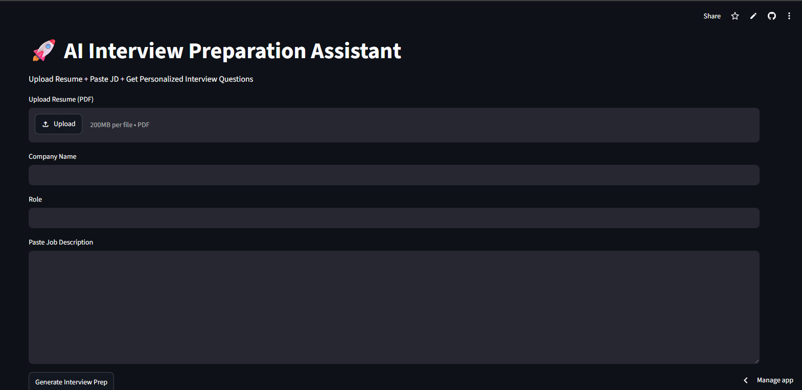
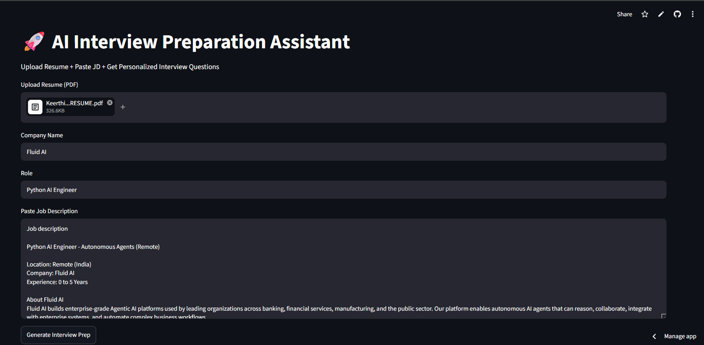
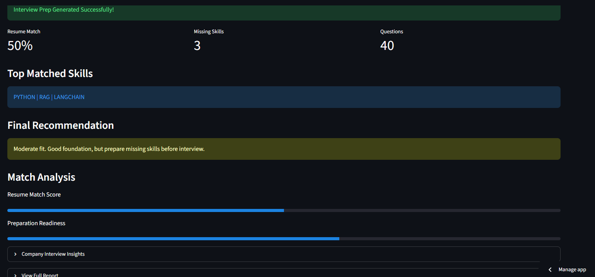

# InterviewAIQ 🚀

An AI-powered interview preparation assistant that analyzes resumes and job descriptions to generate personalized interview insights.

## Live Demo
Frontend (Streamlit): https://interviewaiq.streamlit.app  
Backend (Render): https://interviewaiq1.onrender.com

---

## Features

- Upload resume (PDF)
- Paste job description and company name
- Resume match score calculation
- Missing skills detection
- Personalized interview question generation
- Company-specific interview questions
- Technical and HR question suggestions
- Downloadable interview preparation report

---

## Tech Stack

- Python
- Streamlit
- FastAPI
- LangChain
- Ollama / Llama 3
- Groq API
- FAISS
- Render
- GitHub

---

## Architecture

1. Resume uploaded by user  
2. Resume text extracted from PDF  
3. Job description analyzed  
4. RAG pipeline retrieves relevant context  
5. LLM generates:
   - Match Score
   - Missing Skills
   - Interview Questions
   - Preparation Insights  

---

## Screenshots

### Homepage

### Input Page

### Generated Output

### Report

---

## Project Highlights

- Developed an AI knowledge assistant for contextual question-answering over resumes and job descriptions.
- Designed a RAG pipeline using LangChain, embeddings, and FAISS for semantic retrieval.
- Built automated modules for hyper-personalized interview question generation using Groq and Llama 3.

---

## Future Enhancements

- ATS resume scoring
- Mock interview voice assistant
- Interview performance feedback
- Resume optimization suggestions
